<!-- markdownlint-disable MD013 MD033 MD041 -->

> [!IMPORTANT]
> **Double-blind review notice.** This repository is an anonymized artifact
> prepared solely for double-blind peer review. Author-identifying links
> are withheld for double-blind review.

# UniPhysGen

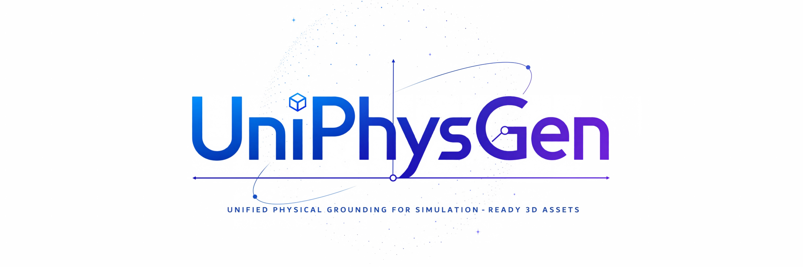

<strong>Links withheld for double-blind review</strong>

<h3 align="center">Unified Physical Grounding for Simulation-Ready 3D Assets</h3>

  <a href="#news"><b>News</b></a> |
  <a href="#introduction"><b>Introduction</b></a> |
  <a href="#components"><b>Components</b></a> |
  <a href="#models"><b>Models</b></a> |
  <a href="#datasets"><b>Datasets</b></a> |
  <a href="#quick-start"><b>Quick Start</b></a> |
  <a href="#results"><b>Results</b></a> |
  <a href="#acknowledgements"><b>Acknowledgements</b></a> |
  <a href="#license"><b>License</b></a>

---

## 📢 News

- We have released the source code for UniPhysGen and the UniPhys Pipeline.

---

## 💡 Introduction

**UniPhysGen** is a unified physical grounding model designed to process segmented 3D objects with heterogeneous part decompositions and generate structured physical semantics for simulation-ready assets. These outputs include part-level physical semantics and intrinsic properties, articulation kinematics and structure, and object-level scale and mass. Unlike previous methods that treat articulation and physical properties independently or rely on canonical part decompositions, UniPhysGen jointly reasons over both under diverse object structures. Together with **UniPhys Pipeline**, which transforms raw meshes into decomposed and simulation-verified assets, it bridges the gap between raw 3D assets and physically grounded representations for embodied AI, robotics, and simulation.

### 🏗️ UniPhys Pipeline: From Raw Meshes to Verified Assets

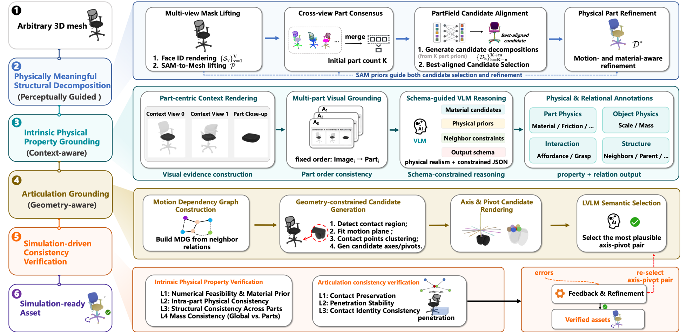

<em>The UniPhys Pipeline turns heterogeneous raw meshes into decomposed, physically grounded, articulated, and simulation-verified assets.</em>

### ✨ UniPhysGen: Unified Physical-Grounding Model

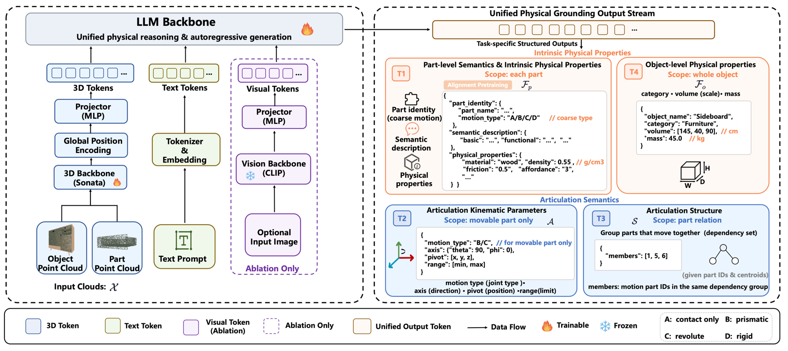

<em>UniPhysGen maps segmented 3D objects with heterogeneous part decompositions to structured physical semantics.</em>

The following UniPhys-Bench examples visualize selected properties of the
benchmark assets.

| Original Mesh | Part Decomposition | Affordance | Articulated Motion |
| :---: | :---: | :---: | :---: |
| Raw textured geometry | Part-level segmentation | 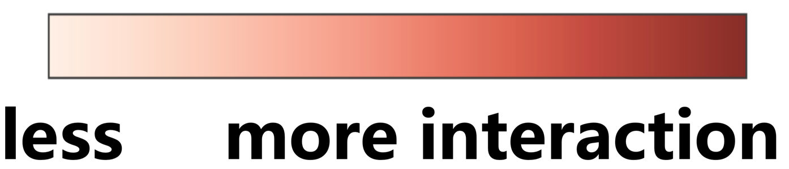 **Redder = more interactive** | All articulated parts in motion |
| 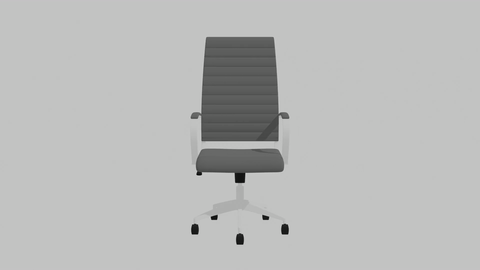 | 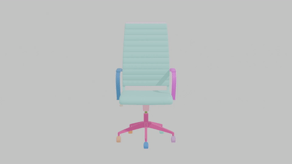 | 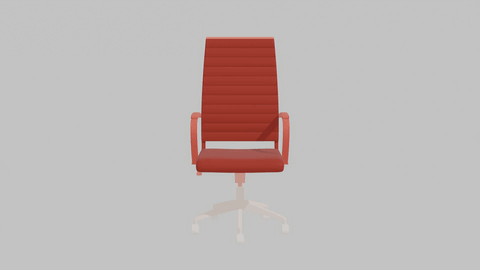 | 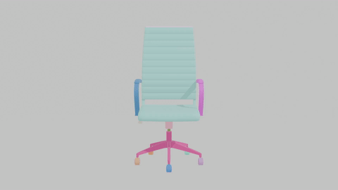 |
| 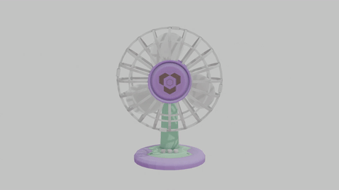 |  | 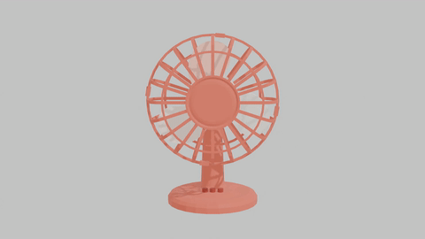 | 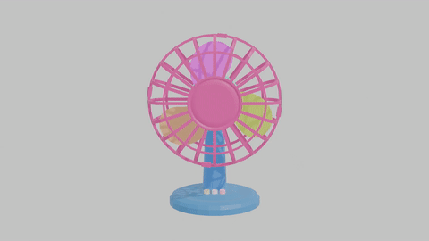 |
| 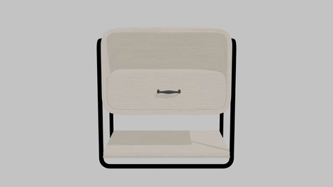 | 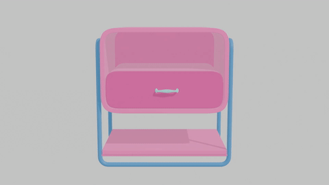 | 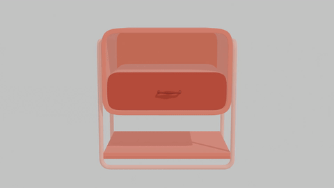 |  |

---

## 🧩 Project Components

| Component | Role | Resource |
| --- | --- | --- |
| **UniPhys Pipeline** | Raw meshes → simulation-ready assets | [Pipeline README](./uniphys_pipeline/README.md) |
| **UniPhysGen** | Segmented 3D objects → unified physical semantics | [Model and training README](./uniphysgen/README.md) |
| **UniPhys-40K** | Large-scale training dataset | Link withheld for double-blind review |
| **UniPhys-Bench** | Human-verified evaluation benchmark | Link withheld for double-blind review |

---

## 🧬 Model Zoo

| Checkpoint | Prediction target | Link |
| --- | --- | --- |
| **Physics checkpoint** | Part identity, semantic descriptions, and intrinsic physical properties | Link withheld for double-blind review |
| **Kinematics checkpoint** | Joint type, axis, pivot, and motion range | Link withheld for double-blind review |
| **Structure checkpoint** | Motion-coupled part group | Link withheld for double-blind review |
| **Object-level checkpoint** | Object identity, category, dimensions, and mass | Link withheld for double-blind review |

[comment]: <> (The initialization checkpoint is a training dependency rather than a task-specific checkpoint. Its role and setup are described in the [UniPhysGen README]&#40;./uniphysgen/README.md&#41;.)

---

## 🗃️ Datasets

| Dataset | Scale | Purpose | Link |
| --- | --- | --- | --- |
| **UniPhys-40K** | 40K (40014) objects · 400K total parts · 370K filtered training parts | Large-scale training corpus with object- and part-level physical grounding annotations | Link withheld for double-blind review |
| **UniPhys-Bench** | 1.9K (1927) objects across two subsets · 16K parts · 5.5K motion-relevant components | Curated benchmark for unified physical-grounding evaluation and simulation-oriented inspection | Link withheld for double-blind review |

> [!NOTE]
> **Simulation-ready URDF assets.** UniPhys-Bench provides URDF files with articulated joint parameters and real-world dimensions in meters. Physical properties are not preconfigured; users can assign them from the provided annotations as needed for their simulator or task.

---

## 🚀 Quick Start

This page is intentionally concise. Choose the path that matches your input and task:

| Goal | Start here |
| --- | --- |
| Convert raw meshes into segmented and simulation-oriented assets | [UniPhys Pipeline README](./uniphys_pipeline/README.md) |
| Install UniPhysGen and run inference | [UniPhysGen README](./uniphysgen/README.md) |
| Use a task-specific checkpoint | [Model Zoo](#models) |
| Reproduce UniPhys-Bench evaluation | [UniPhysGen README](./uniphysgen/README.md) |
| Reproduce training or train on custom data | [UniPhysGen README](./uniphysgen/README.md) |

---

## 📊 Results and Demos

UniPhysGen achieves state-of-the-art performance across most articulation grounding and intrinsic physical property estimation settings on UniPhys-Bench, while remaining robust to heterogeneous part decompositions. The resulting physically grounded assets can be deployed in robotic simulation environments for realistic interaction. Complete quantitative results, qualitative comparisons, and simulation demos are included in the anonymized submission.

---

## 🙏 Acknowledgements

This project builds on ideas, code, models, datasets, and tools from the open-source 3D, vision, and language-model communities. We especially thank:

- [SpatialLM](https://github.com/manycore-research/SpatialLM), [LLaMA-Factory](https://github.com/hiyouga/LlamaFactory), Qwen3, and [Sonata](https://github.com/facebookresearch/sonata) for model and training foundations.
- [SAM 2](https://github.com/facebookresearch/sam2) and [PartField](https://github.com/nv-tlabs/PartField) for components used by the asset-processing workflow.
- [PhysX-3D](https://github.com/ziangcao0312/PhysX-3D) for related work and resources in 3D physical reasoning.
- [PartNet](https://github.com/daerduocarey/partnet_dataset), [ShapeNet](https://shapenet.org/), [Objaverse](https://objaverse.allenai.org/), [HSSD](https://3dlg-hcvc.github.io/hssd/), [3D-FUTURE](https://github.com/3D-FRONT-FUTURE/3D-FUTURE-ToolBox), and [Amazon Berkeley Objects](https://amazon-berkeley-objects.s3.amazonaws.com/index.html) for the source assets and annotations that support the UniPhys datasets, subject to their respective terms.
- Blender, MuJoCo, NVIDIA Isaac Sim, Open3D, and trimesh for the geometry-processing and simulation ecosystem.

Please consult the upstream projects and the repository notice files for full attribution and third-party license terms.

---

## 📜 License

- **Source code:** UniPhysGen and the UniPhys Pipeline are licensed under the Apache License 2.0. See the [UniPhysGen license](./uniphysgen/LICENSE.txt) and [pipeline license](./uniphys_pipeline/LICENSE).
- **Model weights:** Distributed under CC BY-NC 4.0. Link withheld for double-blind review.
- **Datasets:** Their annotations and redistributed assets remain subject to the corresponding dataset cards and the licenses of their original sources. Link withheld for double-blind review.
- **Third-party components:** External code, models, and assets retain their original licenses. See the [UniPhysGen NOTICE](./uniphysgen/NOTICE) and [pipeline third-party notices](./uniphys_pipeline/THIRD_PARTY_NOTICES.md).

#### 🔝 [Back to Top](#top)
